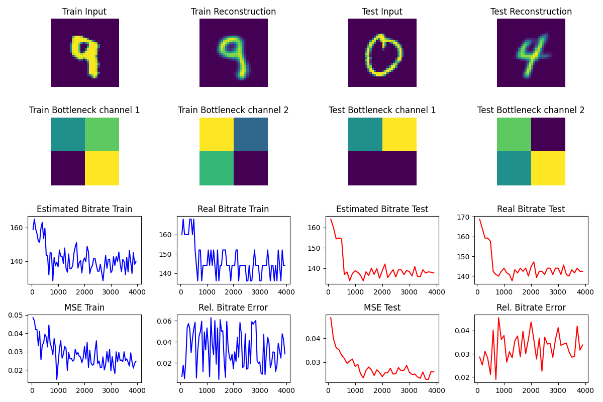

<div align="center">

</div>


# torchac: Fast Arithmetic Coding for PyTorch

[](https://circleci.com/gh/fab-jul/torchac)
[](https://pypi.org/project/torchac/)


<!--[](https://pepy.tech/project/torchac)-->

## About

This is a stand-alone version of the arithmetic coder we used in the 
neural compression paper [Practical Full Resolution Learned Lossless Image 
Compression](https://github.com/fab-jul/L3C-PyTorch) by Mentzer et al.

The backend is written in C++, the API is for PyTorch tensors. Thanks to
on-the-fly compilation with ninja, the integration is seamless.

The implementation is based on [this blog post](https://marknelson.us/posts/2014/10/19/data-compression-with-arithmetic-coding.html),
meaning that we implement _arithmetic coding_.
While it could be further optimized, it is already much faster than doing the equivalent thing in pure-Python (because of all the
 bit-shifts etc.). In L3C, Encoding all pixels of a `512 x 512` image happens in 0.202s (see [Appendix A](https://arxiv.org/abs/1811.12817) in the paper).
 
### What torchac is

- A simple-to-use library to encode a stream of symbols into a bitstream given
  the cumulative distribution (CDF) of the symbols.
The number of possible symbols must be finite.

### What torchac is not

- We do not provide classes to learn or represent probability/cumulative
  distributions. These have to be provided by you.

 
## HowTo

### Set up conda environment

This library has been tested with
- PyTorch 1.5, 1.6, 1.7
- Python 3.8

And that's all you need. Other versions of Python may also work,
but on-the-fly ninja compilation only works for PyTorch 1.5+.

In a supported environment, install `torchac` with `pip`:

```bash
pip install torchac
```

If you don't have an environment already set up, you can make one with `conda`,
see [pytorch.org](https://pytorch.org).

To (optionally) test your installation, you need `pytest`, and then you
can run `python -m pytest tests/test.py -s`. The output should contain
`5 passed, 2 warnings`.

### Example

The `examples/` folder contains [an example for training an auto-encoder on MNIST](https://github.com/fab-jul/torchac/tree/master/examples/mnist_autoencoder).

<div align="center">
  
  <p><em>Output of the example script. First two columns show training
  set, second two columns show testing set.</em></p>
</div>

Snipped from that example:

```python
import torchac

# Encode to bytestream.
output_cdf = ...  # Get CDF from your model, shape B, C, H, W, Lp
sym = ...  # Get the symbols to encode, shape B, C, H, W.
byte_stream = torchac.encode_float_cdf(output_cdf, sym, check_input_bounds=True)

# Number of bits taken by the stream
real_bits = len(byte_stream) * 8

# Write to a file.
with open('outfile.b', 'wb') as fout:
    fout.write(byte_stream)

# Read from a file.
with open('outfile.b', 'rb') as fin:
    byte_stream = fin.read()

# Decode from bytestream.
sym_out = torchac.decode_float_cdf(output_cdf, byte_stream)

# Output will be equal to the input.
assert sym_out.equal(sym)
```

## FAQ

#### 1. Output is not equal to the input

Either normalization went wrong or you encoded a symbol that is `>Lp`,
see below for more details.

## Important Implementation Details

### How we represent probability distributions.

The probabilities are specified as [CDFs](https://en.wikipedia.org/wiki/Cumulative_distribution_function).
For each possible symbol,
we need 2 CDF values. This means that if there are `L` possible symbols
`{0, ..., L-1}`, the CDF must specified the value for `L+1` symbols.

**Example**:
```
Let's say we have L = 3 possible symbols. We need a CDF with 4 values
to specify the symbols distribution:

symbol:        0     1     2
cdf:       C_0   C_1   C_2   C_3

This corresponds to the 3 probabilities

P(0) = C_1 - C_0
P(1) = C_2 - C_1
P(2) = C_3 - C_2

NOTE: The arithmetic coder assumes that C_3 == 1. 
```

Important:

- If you have `L` possible symbols, you need to pass a CDF that
  specifies `L + 1` values. Since this is a common number, we call it 
  `Lp = L + 1` throught the code (the "p" stands for prime, i.e., `L'`).
- The last value of the CDF should be `1`. Note that the arithmetic coder
  in `torchac.cpp` will just assume it's `1` regardless of what is passed, so not having a CDF
  that ends in `1` will mean you will estimate bitrates wrongly. More details below.
- Note that even though the CDF specifies `Lp` values, symbols are only allowed
to be in `{0, ..., Lp-2}`. In the above example, `Lp == 4`, but the 
max symbols is `Lp-2 == 2`. Bigger values will yield **wrong outputs**

### Expected input shapes

We allow any shapes for the inputs, but the spatial dimensions of the
input CDF and the input symbols must match. In particular, we expect:

- CDF must have shape `(N1, ..., Nm, Lp)`, where `N1, ..., Nm` are the
`m` spatial dimensions, and `Lp` is as described above.
- Symbols must have shape `(N1, ..., Nm)`, i.e., same spatial dimensions
as the CDF.

For example, in a typical CNN, you might have a CDF of shape 
`(batch, channels, height, width, Lp)`.

  
### Normalized vs. Unnormalized / Floating Point vs. Integer CDFs

The library differentiates between "normalized" and "unnormalized" CDFs,
and between "floating point" and "integer" CDFs. What do these mean?

- A proper CDF is strictly monotonically increasing, and we call this a
"normalized" CDF. 
- However, since we work with finite precision (16 bits to
be precise in this implementation), it may be that you have a CDF that
is strictly monotonically increasing in `float32` space, but not when
it is converted to 16 bit precision. An "unnormalized" CDF is what we call
a CDF that has the same value for at least two subsequent elements.
- "floating point" CDFs are CDFs that are specified as `float32` and need
to be converted to 16 bit precision.
- "integer" CDFs are CDFs specified as `int16` - BUT are then interpreted
as `uint16` on the C++ side. See "int16 vs uint16" below.

Examples:

```python
float_unnormalized_cdf = [0.1, 0.2, 0.2, 0.3, ..., 1.]
float_normalized_cdf = [0.1, 0.2, 0.20001, 0.3, ..., 1.]
integer_unnormalized_cdf = [10, 20, 20, 30, ..., 0]  # See below for why last is 0.
integer_normalized_cdf = [10, 20, 21, 30, ..., 0]    # See below for why last is 0.
```

There are two APIs:

- `encode_float_cdf` and `decode_float_cdf` is to be used for floating point 
CDFs. These functions have a flag `needs_normalization` that specifies
whether the input is assumed to be normalized. You can set
`need_normalization=False` if you have CDFs that you know are normalized, e.g., 
Gaussian distributions with a large enough sigma. This would then speedup
encoding and decoding large tensors somewhat, and will make bitrate 
estimation from the CDF more precise.
- `encode_int16_normalized_cdf` and `decode_int16_normalized_cdf` is to be 
used for integer CDFs **that are already normalized**.

### int16 vs uint16 - it gets confusing!

One big source of confusion can be that PyTorch does not support `uint16`.
Yet, that's exactly what we need. So what we do is we just represent
integer CDFs with `int16` in the Python side, and interpret/cast them to `uint16`
on the C++ side. This means that if you were to look at the int16 CDFs
you would see confusing things:

```python 
# Python
cdf_float = [0., 1/3, 2/3, 1.]  # A uniform distribution for L=3 symbols.
cdf_int = [0, 21845, -21845, 0]

# C++
uint16* cdf_int = [0, 21845, 43690, 0]
```

Note:
1. In the python `cdf_int` numbers bigger than `2**16/2` are negative
2. The final value is actually 0. This is then handled in `torchac.cpp` which
just assums `cdf[..., -1] == 2**16`, which cannot be represented as a `uint16`.

Fun stuff!

## Citation

If you use the work released here for your research, consider citing this paper:
```
@inproceedings{mentzer2019practical,
    Author = {Mentzer, Fabian and Agustsson, Eirikur and Tschannen, Michael and Timofte, Radu and Van Gool, Luc},
    Booktitle = {Proceedings of the IEEE Conference on Computer Vision and Pattern Recognition (CVPR)},
    Title = {Practical Full Resolution Learned Lossless Image Compression},
    Year = {2019}}
```

